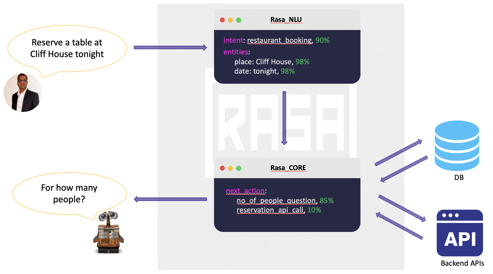
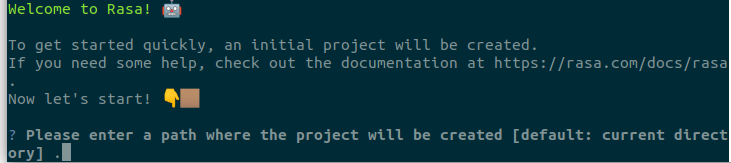
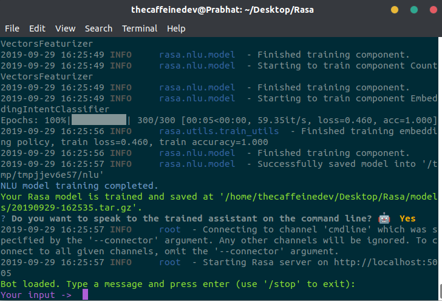
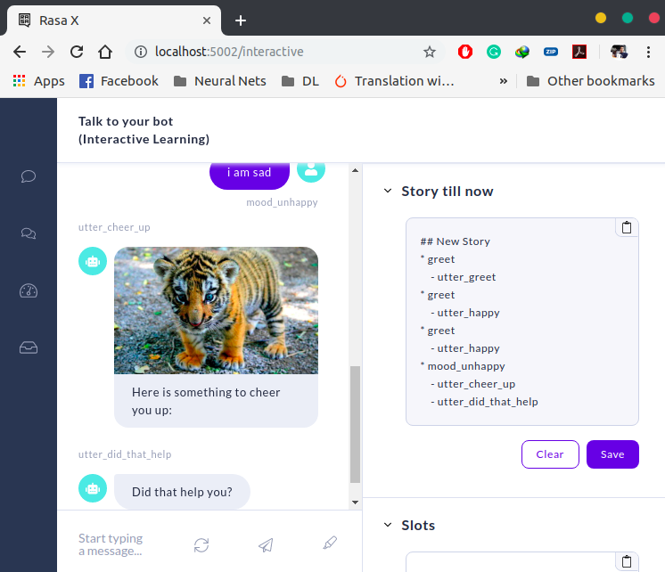

# Conversational Chatbot with Rasa Stack and Python

**RASA stack is an open-source AI tool** and being an opensource framework, It is easy to customize. In fact, In many cases, Clients do not want to share their data and the majority of the tools available are cloud-based and provide **software as a service.** You can not run them internally in your environment. So you need to send your data to the third party. With RASA, There is no such issue. **You can build, deploy or host Rasa internally in your server or environment with complete control on it.**

Rasa comes up with 2 components —

**Rasa NLU —** a *library* for natural language understanding (NLU) which does the classification of intent and extract the entity from the user input and helps bot to understand what the user is saying.

**Rasa Core —** a chatbot *framework* with machine learning-based dialogue management which takes the structured input from the NLU and predicts the **next best action** using a probabilistic model like LSTM neural network.

*NLU and Core are independent and one can use NLU without Core, and vice versa. Though Rasa recommends using both.*



**Few Keywords** 

- **Intent —** Intent is nothing but what the user is aiming for. For example — if the user says *“Reserve a table at Cliff House tonight”* the intent can be classified as to book the table.
- *Entity —* Entity is to extract the useful information from the user input. From the example above “*Reserve a table at Cliff House tonight*” the entities extracted would be place and time. Place — Cliff House and Time — tonight.
- **Stories —** Stories define the sample interaction between the user and chatbot in terms of intent and action taken by the bot. Like in the example above bot got the intent of booking the table and entities like place and time but still, there is an entity missing — no of people and that would make the next action from the bot.
- **Actions —** Actions are basically the operations performed by the bot either asking for some more details to get all the entities or integrating with some APIs or querying the database to get/save some information.

## Rasa Natural Language Understanding (NLU)

As we already briefed on NLU above, we need to teach our bot to understand our messages first. For that, we have to train the NLU model with our inputs in a simple text format and extract structured data. We will achieve this by defining the intents and providing a few ways users might express them.

To make this work, we need to define some files. Lets first understand these files

**NLU training file**: It contains some training data in terms of user inputs along with the mapping of intents and entities present in each of them. The more varying examples you provide, better your bot’s NLU capabilities become.

**Stories file**: Though we will be discussing in details about it in next post but to brief this file contains sample interactions the user and bot will have. Rasa (Core) creates a probable model of interaction from each story.

**Domain file**: This file lists all the intents, entities, actions, templates and some more information. The templates which I just mentioned is nothing but the sample bot reply which can be used as actions. We will discuss this file in details when we discuss Rasa Core.

*Note* — Now Rasa NLU and Rasa Core source code are merged together.

**Rasa X** is a tool that helps you build, improve, and deploy AI Assistants that are powered by the Rasa framework. Rasa X includes a user interface and a REST API. Rasa X is the latest release from Rasa.

It’s a Browser based GUI tool which will allow you to train Machine learning model by using GUI based interactive mode. Remember it’s an optional tool in Rasa Software Stack. Sometimes Rasa sends usage statistics information from your browser to rasa — *but it never sends training data to outside of your system*, *it just sends how many times you are using Rasa X Train.*

## Objective

Before we create an NLU training file Lets first understand what our bot is going to do. *We are going to build the Bot  which will help the user to get the news from around the world and also in the specific categories like sports, business, entertainment, technologies and more.*

## Installation & Setup

Lets first do the environment setup and for that, we need to install python. I am using Conda (Anaconda) to set up the virtual environment for Python and would highly recommend creating one as It would be good to have all the Rasa installation at one place.

First, install the Conda(Anaconda) from [here](https://www.anaconda.com/distribution/) as per the OS. After installation check the Conda version in your terminal .

```bash
conda --version or conda -V
```

Once Conda is installed we should create the virtual environment and proceed with further [installation of Rasa NLU packages](https://rasa.com/docs/nlu/installation). 

```bash
conda install python=3.6
conda create -n rasa python=3.6
conda activate rasa
pip install rasa-x --extra-index-url https://pypi.rasa.com/simple
```

By following the above command, both Rasa and Rasa X will be installed in your system.

# Create a new Project in Rasa

Open Terminal and activate Conda Virtual Environment. Now go-to one directory and do “**rasa init**”, it will create a Rasa Project at that location. “rasa x” will start the Rasa X application

```bash
source activate rasa
rasa init
```



“**rasa init**” should show above message, in-case you are doing well and your system doesn’t contain any error. Follow the interactive session and continue pressing enter to reach the last step. In the end, it should show this message.



# Rasa Configuration

Let me explain about files, which are created as Initial project structure of Rasa.

`__init__.py`an empty file that helps python find your actions

`actions.py`code for your custom actions. In-case you want Rasa to call external server via REST API or API call, you can define your Custom Actions here. Remember you can create multiple Python Script for Rasa Custom Action.

`config.yml` ‘*’configuration of your NLU and Core models. In-case you are dealing with Tensorflow or Spacy, you need to define such pipeline here. To handle this file, you show know about Machine Learning and Deep Learning.

`credentials.yml`details for connecting to other services. In case you want to build Bot on Facebook Messenger, Microsoft Bot Framework, you can maintain such credential and token here. So basically you just need to add Facebook, slack and Bot framework related configuration, rasa will automatically do rest for you. Remember that you need to host Rasa over https domain. During development, you can use **ngrok** as a testing tool.

`data/nlu.md` ‘*’your NLU training data. Here you can define Intent. Like Order Pizza or Book Uber. You need to add related Sentences for that Intent. Remember if you are using Rasa-X, your training Intent and Data will be added automatically.

`data/stories.md` ‘*’your stories. This is required for Rasa Core. There is something called “Dialog Flow in Rasa” where Rasa Core controls the flow of the conversation between you and chatbot, so for that flow, you need to train chatbot using these stories. So in case you want your chatbot to be very perfect on different context (stories) you can add those stories here.

`domain.yml` ‘*’your assistant’s domain. This file combines Different Intent which chatbot can detect and list of Bot replies. Remember you can define your Custom Action Server Python method name here (in underscore format), so that Rasa will call that python method for you.

`endpoints.yml`details for connecting to channels like FB messenger. This is mainly used for production setup. You can configure your Database like Redis so that Rasa can store tracking information.

`models/<timestamp>.tar.gz`your initial model

# How to use Rasa-X

This is the newest addition to Rasa Stack. You can user Rasa-X to Try your chatbot on Browser. You can download training Data. Also, you can correct your training data by guiding your Bot.

```bash
rasa x
```

It will ask for the license Agreement, you can say “y” and proceed.

A link will get open up in your browser:

In the left side, you can try to chat with your bot and on the right side you can see, which intent and reply is getting responded.



**Some facts about Rasa-x**

When you run Rasa X locally, your training data and stories are read from the files in your project (e.g. `data/nlu.md`), and any changes you make in the UI are saved back to those files. Conversations and other data are stored in an SQLite database saved in a file called `rasa.db`.

**I will talk about Rasa Custom Server later**

#### Some commands to remember 

## Commands
Create new project in Rasa
```bash
rasa init
```

Start Rasa-X
```bash
rasa x
```

Start Rasa without Rasa-X GUI
```bash
rasa run
```

Re-train your rasa model
```bash
rasa train
```

Start Rasa Action Server
```bash
rasa run actions
```

## References

1. https://rasa.com/
2. https://github.com/RasaHQ/rasa
3. https://www.analyticsvidhya.com/blog/2019/04/learn-build-chatbot-rasa-nlp-ipl/
4. https://www.youtube.com/watch?v=-F6h43DRpcU
5. https://hackernoon.com/building-a-chatbot-using-rasa-stack-intro-and-tips-c6d1057d8536
